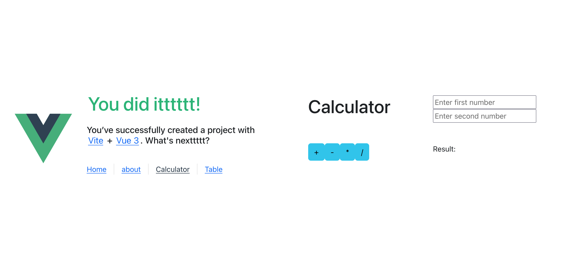
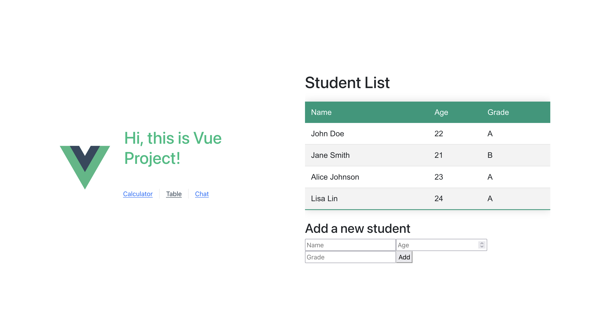

# StudentRegistry-Frontend

This Vue.js project, StudentRegistry, features a calculator and a student table. It utilizes PostgreSQL as the database and is powered by a Spring Boot backend.

## Project Setup

```sh
npm install
```

### Compile and Hot-Reload for Development

```sh
npm run dev
```

### Type-Check, Compile and Minify for Production

```sh
npm run build
```

### Run Unit Tests with [Vitest](https://vitest.dev/)

```sh
npm run test:unit
```

### Url

`
http://localhost:5173/
`
## Calculator


## studentTable

