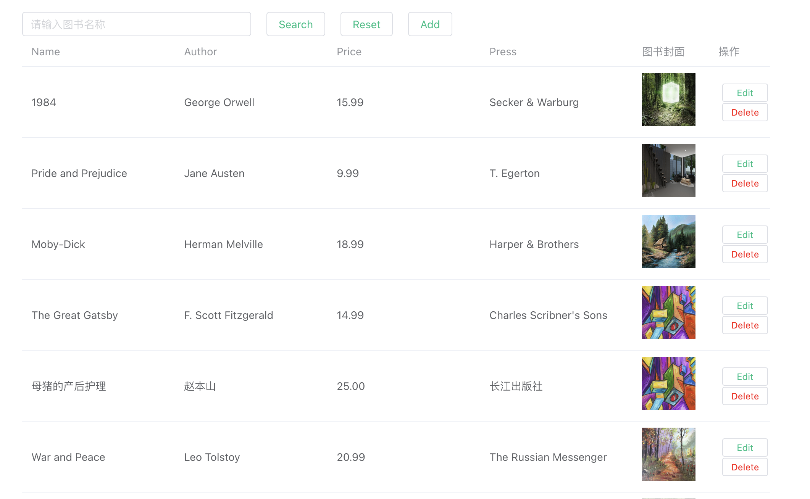

# StudentRegistry-Frontend

This template should help get you started developing with Vue 3 in Vite.

## Tech Stack

- **Frontend Framework**: Vue 3
- **UI Library**: Element UI Plus

## Recommended IDE Setup

[VSCode](https://code.visualstudio.com/)

## Customize configuration

See [Vite Configuration Reference](https://vitejs.dev/config/).

## Project Setup

```sh
npm install
```

### Compile and Hot-Reload for Development

```sh
npm run dev
```

### Type-Check, Compile and Minify for Production

```sh
npm run build
```

### Url

`http://localhost:5173/`

## Authorisation System(Use JWT)

### Register

<div align="center">
    
</div>

### Login

<div align="center">
    
</div>

Username: `Jane Smith`</br>
Password: `123456`

## Book table



The `Book Table` is a table that displays the list of books in the data source. It provides the following features:

- **Add a new student**: Allows the user to add a new book to the table, including the book's title, author, and previews of images.
- **Edit student information**: Enables the user to edit the information of an existing book in the table.
- **Delete a book**: This allows the user to delete a book from the table.
- **Update book information**: Provides the ability to update the details of a specific book in the table.
